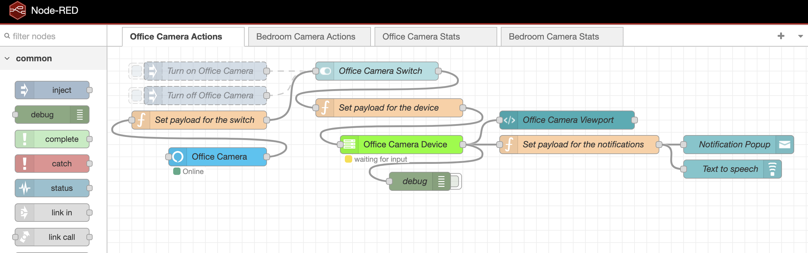
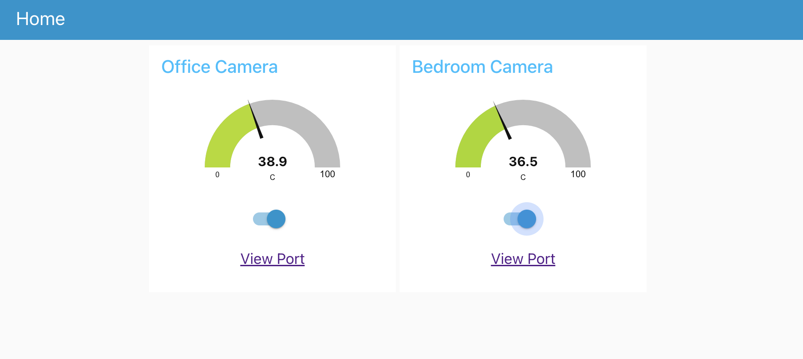

Getting Started
---------------

### Introduction

This repository provides scripts and configurations for controlling a USB camera attached to a Raspberry Pi device.
It includes:

* Automated control of the camera using `motion` and `Node-RED` for the automation workflows and UI. 
* Shell scripts responsible to start/stop the camera capture and also fetch stats of the Raspberry PI device via SSH/

### Requirements

#### Hardware

* [Raspberry Pi](https://www.raspberrypi.com/products/) - 3 or later is recommended.
* External USB Camera ([Logitech](https://www.logitech.com/en-us/shop/c/webcams) is a good choice, but it is not limited.
to).

#### Software
* Any [Linux distribution](https://www.raspberrypi.com/software/) compatible with Raspberry PI.
* [motion](https://motion-project.github.io/motion_download.html) package installed.   
* [python3](https://www.python.org/) installed in the Raspberry PI.
* [Node-RED](https://nodered.org/docs/getting-started/) installed in the Raspberry PI or in any other machine (It can be
a VM).
* Node-RED widgets/nodes: [node-red-contrib-cron](https://flows.nodered.org/node/node-red-contrib-cron) and 
[node-red-contrib-ssh-v3](https://flows.nodered.org/node/node-red-contrib-ssh-v3). To install them, go to manage palette 
in Node-RED editor, click in the install tab, type the widget name and then click in the install button. Please refer to
Node-RED documentation.
* **SSH Access:** Ability to SSH into the Raspberry Pi from the machine running Node-RED.

### Installation

1.  **Clone the repository:**

    ```bash
    git clone https://github.com/fvilarinho/raspberry-camera.git
    cd raspberry-camera
    ```
    
2.  **Install/Access Node-RED:**

    ```bash
    # Via NPM
    sudo npm install -g --unsafe-perm node-red
    r
    # Via Docker
    docker run -it -p 1880:1880 -v node_red_data:/data --name mynodered nodered/node-red
    ```
    - Access the Node-RED editor in your browser at http://<ip-machine-running-nodered>:1880 to edit the automations
    workflows.
    - Access the Node-RED dashboards in your browser at http://<ip-machine-running-nodered>:1880/ui to visualize the 
    automations
    workflows.
    - It is recommended to follow these [instructions](https://nodered.org/docs/user-guide/runtime/securing-node-red) to 
    improve security.


3.  **Configure SSH Access:** Ensure that the machine running Node-RED can connect to the Raspberry Pi via SSH.
    This may require setting up SSH keys or configuring password authentication. Please check out the details [here](https://www.openssh.org/).


4.  **Install automation scripts**
    - Copy `camera` directory, all `.sh` and `.py` files of this repository to the user's home directory in Raspberry PI
    device.
    - Ensure they have execution permission.


5.  **Configure Motion:**
    - This involves modifying the `camera/motion.template` file.  Important settings to adjust:
        * `width`: Image width in pixels.
        * `height`: Image height in pixels.
        * `framerate`: Maximum number of frames to be captured per second.
        * `webcontrol_port`: The port on which the control interface will be served.
        * `webcontrol_localhost`: Must be set to off to enable remote access.
        * `stream_maxrate`: Maximum number of frames to be streamed per second.
        * `stream_authentication`: Definition of the user and password to access the stream.
        * `stream_auth_method`: Authentication method (1 for basic).
        * `stream_port`: The port on which the stream will be served.
        * `stream_localhost`: Must be set to off to enable remote access.


6.  **Import Node-RED workflow:**
    - Import the file `flows.json` it into your Node-RED instance using the import function in the editor. Modify it as 
    you wish.
    - Edit the global environment variables `camera_hostname` (specify a hostname or the IP of the Raspberry PI device) 
    and `camera_home_dir` in Node-RED to point to the right location of the scripts.

### Screenshots


Node-RED automation workflow


Node-RED automation UI

### Considerations

*   **Error Handling:**  Improve error handling in Node-RED workflows and shell scripts.
*   **Configuration File:**  Use a configuration files in Node-RED workflows and shell scripts to make everything easier to 
maintain.
*   **Secure SSH Authentication:**  Use SSH keys for secure authentication.
*   It's not a good practice to commit any sensitive data in the repository so... **DON'T EXPOSE OR COMMIT ANY SENSITIVE
DATA IN THE PROJECT.**

### Contact
**Website:** - https://vilanet.sh

**e-Mail:**
- fvilarinho@gmail.com
- fvilarinho@outlook.com
- me@vila.net.br

and that's all! Have fun!